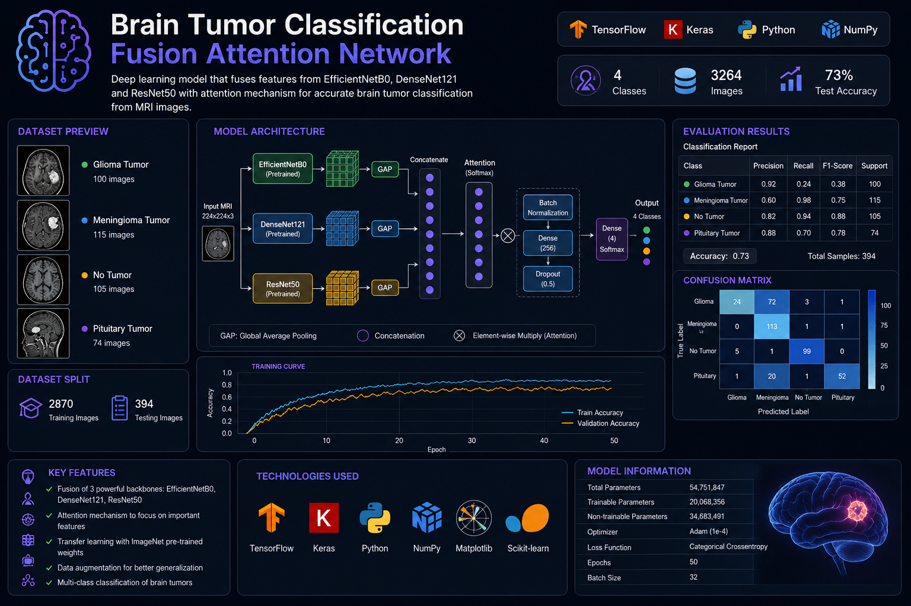
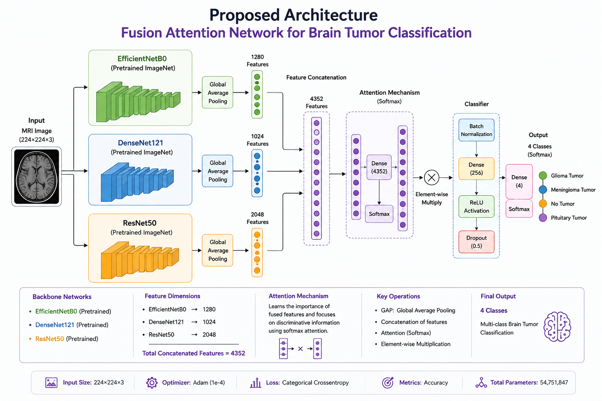
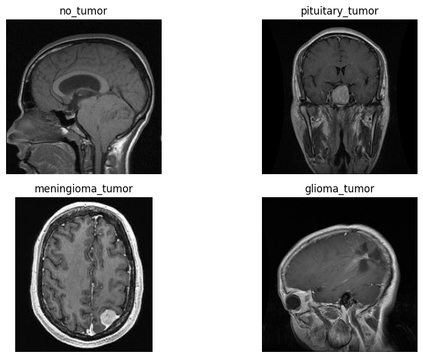
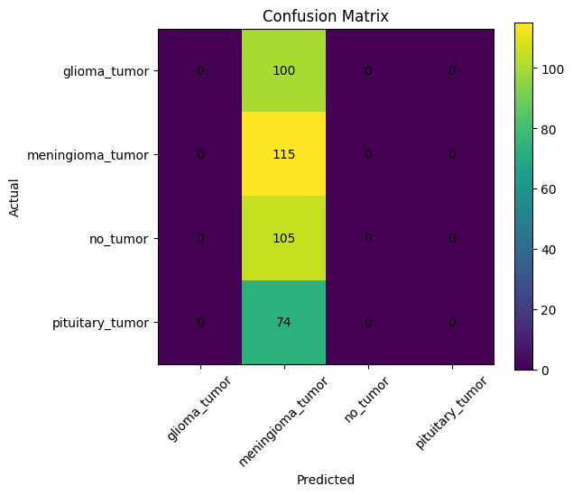

# Brain-Tumor-Classification-Fusion-Attention

Brain Tumor Classification using a Fusion Attention Network that combines EfficientNetB0, DenseNet121, and ResNet50 for multi-class MRI image classification. The proposed architecture leverages feature fusion and attention mechanisms to improve tumor detection performance, achieving **73% test accuracy** across four tumor categories.

<p align="center">
  
</p>

<h1 align="center">Brain Tumor Classification</h1>

<h3 align="center">
Fusion Attention Network using EfficientNetB0 + DenseNet121 + ResNet50
</h3>

<p align="center">
  
  
  
  
</p>

---

## Dataset Information

This project utilizes the Brain Tumor MRI Dataset containing four classes:

* Glioma Tumor
* Meningioma Tumor
* Pituitary Tumor
* No Tumor

Dataset Statistics:

* Training Images: 2870
* Testing Images: 394
* Total Images: 3264

Due to GitHub storage limitations, the dataset is not included in this repository.

---

## Proposed Architecture

<p align="center">
  
</p>

---

### Model Pipeline

MRI Image (224×224×3)

↓

EfficientNetB0 (Pretrained)

DenseNet121 (Pretrained)

ResNet50 (Pretrained)

↓

Global Average Pooling

↓

Feature Concatenation

↓

Attention Mechanism

↓

Batch Normalization

↓

Dense Layer (256)

↓

Dropout (0.5)

↓

Softmax Classification (4 Classes)

---

## MRI Dataset Samples

<p align="center">
  
</p>

---

## Experimental Results

<p align="center">
  
</p>

### Classification Report

| Class      | Precision | Recall | F1-Score |
| ---------- | --------- | ------ | -------- |
| Glioma     | 0.92      | 0.24   | 0.38     |
| Meningioma | 0.60      | 0.98   | 0.75     |
| No Tumor   | 0.82      | 0.94   | 0.88     |
| Pituitary  | 0.88      | 0.70   | 0.78     |

### Overall Performance

* Test Accuracy: 73%
* Multi-Class Classification
* Transfer Learning Based Approach
* Attention-Driven Feature Fusion

---

## Model Weights

This folder stores trained model weights.

Best Performing Model:

* fusion_attention_model_fixed.h5

Model Details:

* Total Parameters: 54,751,847
* Trainable Parameters: 20,068,356
* Non-Trainable Parameters: 34,683,491

---

## Installation

```bash
git clone https://github.com/your-username/Brain-Tumor-Classification-Fusion-Attention.git

cd Brain-Tumor-Classification-Fusion-Attention

pip install -r requirements.txt
```

---

## Project Structure

```bash
Brain-Tumor-Classification-Fusion-Attention/
│
├── assets/
│   ├── banner.png
│   ├── architecture.png
│   ├── mri_samples.png
│   └── results.png
│
├── data/
│   ├── Training/
│   └── Testing/
│
├── models/
│   └── fusion_attention_model_fixed.h5
│
├── notebooks/
│   └── Brain_Tumor_Classification.ipynb
│
├── src/
│   ├── train.py
│   ├── evaluate.py
│   ├── model.py
│   └── utils.py
│
├── requirements.txt
├── README.md
├── LICENSE
└── .gitignore
```

---

## Technologies Used

* Python
* TensorFlow
* Keras
* NumPy
* Matplotlib
* Scikit-learn
* EfficientNetB0
* DenseNet121
* ResNet50
* Transfer Learning

---

## Key Highlights

* Fusion of Three State-of-the-Art CNN Architectures
* Attention-Based Feature Fusion Strategy
* Transfer Learning using ImageNet Weights
* Multi-Class Brain Tumor Classification
* MRI-Based Medical Image Analysis
* Data Augmentation for Improved Generalization
* End-to-End Deep Learning Pipeline
* Lightweight Attention Mechanism

---

## Future Improvements

* Fine-Tuning Pretrained Backbones
* Vision Transformer (ViT) Integration
* Explainable AI (Grad-CAM)
* Real-Time Clinical Deployment
* Model Quantization for Edge Devices
* Ensemble Learning with Advanced Attention Modules

---

**Pranav**

Deep Learning | Computer Vision | Medical Imaging | AI Research

---

*future ai engineering 

